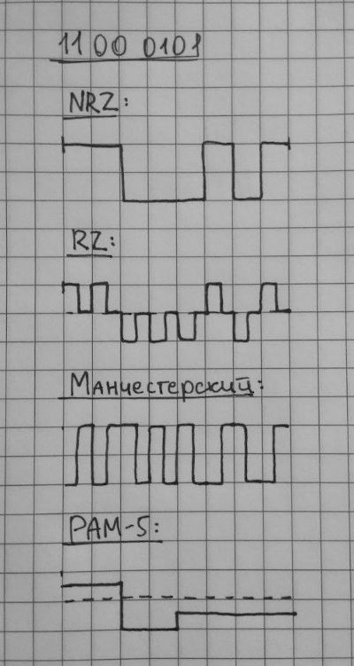

# Контрольные вопросы для самопроверки

### Что такое потенциальное кодирование?

Метод цифрового кодирования, в котором для представления двоичных нулей и единиц
используются различные значения потенциала сигнала (напряжения).

### В чем отличие импульсных кодов от потенциальных?

При импульсном цифровом кодировании двоичные нули и единицы представлены
импульсами разной полярности или перепадами потенциала.

### Как изменяется спектр сигнала при потенциальном кодировании, если в передаваемом сообщении появляется длинная последовательность нулей или единиц?

Рассмотрим NRZ:
* верхняя граница частот образуется при передаче чередующихся значений `1` и `0`
и равна `C/2` (`C` — пропускная способность канала)
* нижняя граница частот образуется при передаче последовательности `1...` или `0...`
и равна `C/(2*n)` (`n` — наибольшая длина последовательности в сообщении)

Ширина спектра сигнала `S = f_в - f_н`, следовательно, чем длинее
последовательности из нулей или единиц в сообщении, тем шире спектр.

### В каком случае при потенциальном кодировании в спектре сигнала отсутствует постоянная составляющая?

### Достоинства и недостатки рассмотренных методов физического кодирования

NRZ:
* (+) простота и низкая стоимость из-за применения лишь двух уровней потенциала
* (-) отсутствие самосинхронизации; длинные последовательности из нулей или единиц
могут привести к рассинхронизации приемника и передатчика

RZ:
* (+) самосинхронизация (возврат к нулевому потенциалу в середине каждого битового интервала)
* (-) три уровня сигнала требуют повышенной мощности передатчика для обеспечения достоверности приема
* (-) спектр сигнала шире, чем у потенциальных кодов

Манчестерский код:
* (+) самосинхронизация (изменение сигнала в середине каждого битового интервала)
* (+) спектр сигнала уже, чем у RZ
* (+) применение лишь двух уровней потенциала
* (-) спектр сигнала шире, чем у NRZ

Пятиуровневый код PAM-5:
* (+) передача двух бит в одном битовом интервале (кодируется `00`, `01`, `10`, `11`)
* (-) высокая стоимость реализации из-за пяти уровней сигнала
* (-) отсутствие самосинхронизации (постоянная составляющая
при передаче последовательностей одинаковых пар)

### Нарисовать диаграммы рассмотренных методов физического кодирования для сообщения `С5`

`C5` = `1100 0101`.

### Для чего используется логическое кодирование?

Логическое кодирование устраняет длинные последовательности единиц и нулей, которые
могут привести к рассинхронизации и появлению ошибок при физическом кодировании
потенциальным кодом.

### Перечислить методы логического кодирования, пояснить их принципы

#### Избыточное кодирование

Сообщение разбивается на последовательности определенной длины, которые
заменяются новыми по специальным таблицам перекодировки.

Рассмотрим в качестве примера *4B/5B* — замена каждых четырех бит пятью.

Новые последовательности выбраны так, чтобы после кодирования в сообщении
не могло встретиться больше восьми подряд идущих единиц. Это дает потенциальным
кодам свойство самосинхронизации (отсутствие постоянной составляющей)
и сужает спектр сигнала.

Также появляется 16 избыточных комбинаций (`2^5 - 2^4`), которые становятся
запрещенными, что позволяет обнаружать ошибки в передаваемых данных.

Основной недостаток — 25% избыточность, из-за чего реальная пропускная
способность канала будет меньше номинальной.

#### Скремблирование

Сообщение преобразуется по заданному алгоритму с целью предотвращения появления
длинных последовательностей нулей или единиц.

Пример алгоритма преобразования: `B_i = A_i xor B_{i-3} xor B_{i-5}`, где
`A_i` — `i`-й бит сообщения, `B_i` — `i`-й бит результирующего кода.

Обратный алгоритм, реализуемый дескремблером: `C_i = B_i xor B_{i-3} xor B_{i-5}`.

Алгоритмы различаются количеством слагаемых и величиной сдвига между ними.

Основное достоинство метода — сохранение пропускной способности канала.
К недостаткам можно отнести возможность возникновения длинных последовательностей
нулей и единиц (хотя она значительно меньше, чем без применения скремблирования).

---

### При каком методе кодирования скорость модуляции (бод) и скорость передачи данных (бит в секунду) совпадают?

### Почему потенциальные коды на каналах тональной частоты никогда не используются?

### У какого из известных вам методов верхняя граница частот имеет наименьшее значение?

### Определить частоту основной гармоники для сообщения, заданного в шестнадцатеричном коде: С5, при использовании методов кодирования NRZ, RZ, AMI, MLT-3, Манчестер 2...

### Какой метод кодирования применяется в ЛВС Ethernet и Token Ring?

### Какой метод логического кодирования используется в ЛВС Fast Ethernet и FDDI?
