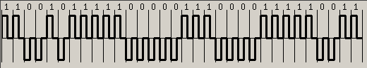

## Цель

Изучение  методов  физического  и  логического кодирования,
используемых в цифровых сетях передачи данных.

## Задание

В процессе выполнения работы необходимо выполнить логическое и физическое
кодирование исходного сообщения в соответствии с заданными методами кодирования,
провести сравнительный анализ рассматриваемых методов кодирования, выбрать и обосновать
наилучший метод для передачи исходного сообщения.

## Ход работы

### Этап 1. Формирование сообщения

Исходное сообщение: `Лабушев Т.М.`

В шестнадцатеричном коде: `CB E0 E1 F3 F8 E5 E2 20 D2 2E CC 2E`

В двоичном коде: `11001011 11100000 11100001 11110011 11111000 11100101 11100010 00100000 11010010 00101110 11001100 00101110`

Длина сообщения: 12 байт (96 бит)

### Этап 2. Физическое кодирование исходного сообщения

#### Определение частот

Возьмем за основу разложение сигнала `10101010` в ряд Фурье ???

#### Потенциальный код NRZ

Результат кодирования первых четырех байт сообщения:


Минимальный период достигается при кодировании чередующихся сигналов (`010`), а максимальный период — при кодировании последовательности единиц или нулей.

Поскольку в исходном сообщении встречаются чередующиеся сигналы `01` и `10`, мы рассматриваем период дискретного сигнала $T_0 = 2t$, где $t = \frac{1}{C}$ — время передачи одного бита, $C$ — пропускная способность канала. Таким образом, частота основной гармоники $f_0 = \frac{1}{T_0} = \frac{1}{2}C$.

Используя $T_0$, мы можем выразить максимальный период как `T_{max} = NT_0`, где $N$ — количество бит в самой длинной нечередующейся последовательности. В рассматриваемом сообщении такой последовательностью является `1111111` ($N=7$), следовательно, $T_{max} = 7T_0$. Минимальный период в NRZ кодировании равен $T_0$.

Найдем верхнюю и нижнюю границу частот, разложив сигналы в ряд Фурье:
$$\sum_{i\in{1,3,5,7}} \frac{1}{i}A_0sin(2\pi f_it),\ f_i = \frac{1}{T}i$$
Гармониками высших порядков пренебрежем из-за их малого вклада в результирующий сигнал.

Для сигнала из чередующихся единиц и нулей ($T_{max}$) получим:
$$A_0sin(2\pi \frac{1}{7}f_0t) + \frac{1}{3}A_0sin(2\pi \frac{3}{7}f_0t) + \frac{1}{5}A_0sin(2\pi \frac{5}{7}f_0t) + \frac{1}{7}A_0sin(2\pi f_0t) \implies f_{min} = \frac{1}{7}f_0$$

Для сигнала из семи последовательных единиц ($T_{min}$) получим:
$$A_0sin(2\pi f_0t) + \frac{1}{3}A_0sin(2\pi 3f_0t) + \frac{1}{5}A_0sin(2\pi 5f_0t) + \frac{1}{7}A_0sin(2\pi 7f_0t) \implies f_{max} = 7f_0$$

Таким образом, спектр сигнала: $\frac{1}{7}f_0\ldots 7f_0$.

Рассчитаем значения, зависящие от пропускной способности канала $C$:

* Частоту основной гармоники сигнала из последовательности `1111111...`: ?
* Нижнюю границу частот $f_{min} = \frac{1}{7}f_0 = \frac{1}{7}\cdot\frac{1}{2}C$
* Верхнюю границу частот $f_{max} = 7f_0 = 7\cdot\frac{1}{2}C$
* Необходимую полосу пропускания $F = f_{min} \ldots f_{max}$

Для нахождения среднего значения частоты передаваемого сообщения,
обратимся к диаграмме передачи первых четырех байтов.
На ней можно выделить пять участков с различными частотами:

* $f_1 = f_0$ при кодировании `0` и `1` (2 бита из 32)
* $f_2 = \frac{1}{2}f_0$ при кодировании `00` и `11` (8 бит из 32)
* $f_3 = \frac{1}{3}f_0$ при кодировании `000` и `111` (3 бита из 32)
* $f_4 = \frac{1}{4}f_0$ при кодировании `0000` и `1111` (4 бита из 32)
* $f_5 = \frac{1}{5}f_0$ при кодировании `00000` и `11111` (15 бит из 32)

Возьмем их среднее арифметическое:

$$f_{mean} = \frac{2}{32}\cdot f_0 + \frac{8}{32}\cdot\frac{1}{2}\cdot f_0 + \frac{3}{32}\cdot\frac{1}{3}\cdot f_0 + \frac{4}{32}\cdot\frac{1}{4}\cdot f_0 + \frac{15}{32}\cdot\frac{1}{5}\cdot f_0$$

```{r, echo=F}
mhz <- function(n, digits=4) toString(round(n / 10^6, digits))
nrz_fmin <- function(bps) 1/7*1/2*bps
nrz_fmax <- function(bps) 7*1/2*bps
nrz_fmean <- function(bps)
  (2/32*(1/2*bps) + 8/32*1/2*(1/2*bps) + 3/32*1/3*(1/2*bps) + 4/32*1/4*(1/2*bps) + 15/32*1/5*(1/2*bps))
```

##### Рассчитанные показатели

| $C$, бит/с | $f_{1\ldots}$, МГц | $f_{min}$, МГц | $f_{max}$, МГц | $F$, МГц | $f_{mean}$, МГц |
| --- | --- | --- | --- | --- | --- |
| $10^7$ | | $`r mhz(nrz_fmin(10^7), 6)`$ | $`r mhz(nrz_fmax(10^7))`$ | $`r mhz(nrz_fmin(10^7), 2)` \ldots `r mhz(nrz_fmax(10^7))`$ | $`r mhz(nrz_fmean(10^7))`$ |
| $10^8$ | | $`r mhz(nrz_fmin(10^8), 5)`$ | $`r mhz(nrz_fmax(10^8))`$ | $`r mhz(nrz_fmin(10^8), 1)` \ldots `r mhz(nrz_fmax(10^8))`$ | $`r mhz(nrz_fmean(10^8))`$ |
| $10^9$ | | $`r mhz(nrz_fmin(10^9), 4)`$ | $`r mhz(nrz_fmax(10^9))`$ | $`r mhz(nrz_fmin(10^9), 0)` \ldots `r mhz(nrz_fmax(10^9))`$ | $`r mhz(nrz_fmean(10^9))`$ |

#### Импульсный код RZ

Результат кодирования первых четырех байт сообщения:



Минимальный период достигается при кодировании последовательных единиц или нулей (`11`, `00`), а максимальный период — при кодировании чередующихся сигналов (`01`, `10`). Примем $T_{max} = T_0$, тогда $T_{min} = \frac{1}{2}T$.

Разложим в ряд Фурье сигнал из чередующихся единиц и нулей ($T_{max}$):
$$A_0sin(2\pi f_0t) + \frac{1}{3}A_0sin(2\pi 3f_0t) + \frac{1}{5}A_0sin(2\pi 5f_0t) + \frac{1}{7}A_0sin(2\pi 7f_0t) \implies f_{min} = f_0$$

Разложим в ряд Фурье сигнал из последовательнызх единиц и нулей ($T_{min}$):
$$A_0sin(2\pi 2f_0t) + \frac{1}{3}A_0sin(2\pi 6f_0t) + \frac{1}{5}A_0sin(2\pi 10f_0t) + \frac{1}{7}A_0sin(2\pi 14f_0t) \implies f_{max} = 14f_0$$

Получим спектр сигнала $f_0\ldots 14f_0$.

Рассчитаем значения, зависящие от пропускной способности канала $C$:

* Частоту основной гармоники сигнала из последовательности `1111111...` вычислим, представив последовательность как повторяющийся сигнал `11`, частота основной гармоники которого известна ($2f_0$): $f_{1\ldots} = 2f_0 = C$
* Нижнюю границу частот $f_{min} = f_0 = \frac{1}{2}C$
* Верхнюю границу частот $f_{max} = 14f_0 = 14\cdot\frac{1}{2}C$
* Необходимую полосу пропускания $F = f_{min} \ldots f_{max}$

Для нахождения среднего значения частоты передаваемого сообщения, обратимся к диаграмме передачи первых четырех байтов.
На ней можно выделить два вида участков с различными частотами:

* $f_1 = f_0$ при кодировании `01` и `10` (8 бит из 32)
* $f_2 = 2f_0$ при кодировании `00` и `11` (24 бит из 32)

Возьмем их среднее арифметическое:

$$f_{mean} = \frac{8}{32}\cdot f_0 + \frac{24}{32}\cdot2f_0$$

```{r, echo=F}
rz_fmin <- function(bps) 1/2*bps
rz_fmax <- function(bps) 14*1/2*bps
rz_fmean <- function(bps) 8/32*(1/2*bps) + 24/32*2*(1/2*bps)
```

##### Рассчитанные показатели

| $C$, бит/с | $f_{1\ldots}$, МГц | $f_{min}$, МГц | $f_{max}$, МГц | $F$, МГц | $f_{mean}$, МГц |
| --- | --- | --- | --- | --- | --- | --- |
| $10^7$ | $`r mhz(10^7)`$ | $`r mhz(rz_fmin(10^7))`$ | $`r mhz(rz_fmax(10^7), 6)`$ | $`r mhz(rz_fmin(10^7))` \ldots `r mhz(rz_fmax(10^7))`$ | $`r mhz(rz_fmean(10^7))`$ |
| $10^8$ | $`r mhz(10^8)`$ | $`r mhz(rz_fmin(10^8))`$ | $`r mhz(rz_fmax(10^8), 5)`$ | $`r mhz(rz_fmin(10^8))` \ldots `r mhz(rz_fmax(10^8))`$ | $`r mhz(rz_fmean(10^8))`$ |
| $10^9$ | $`r mhz(10^9)`$ | $`r mhz(rz_fmin(10^9))`$ | $`r mhz(rz_fmax(10^9), 4)`$ | $`r mhz(rz_fmin(10^9))` \ldots `r mhz(rz_fmax(10^9))`$ | $`r mhz(rz_fmean(10^9))`$ |

#### Манчестерский код

Результат кодирования первых четырех байт сообщения:


Минимальный период достигается при кодировании последовательности единиц или нулей (`11`, `00`), а максимальный период — при кодировании чередующихся единиц и нулей (`10`, `01`), то есть $T_{max} = 2T_{min} = T_0$.

Можно увидеть, что эти показатели полностью соответствует импульсному коду RZ, а следовательно, у данных кодов совпадает и разложение сигналов в ряд Фурье, и формулы для подсчета значений, зависящих от пропускной способности канала $C$.

???

#### Пятиуровневый код PAM-5 (потенциальный код 2B1Q)

Результат кодирования первых четырех байт сообщения:


Минимальный период достигается при кодировании последовательности `110011` ($T_{min} = 2T_0$), а максимальный период — при кодировании последовательности `10111110` ($T_{max} = 8T_0$).

Разложим в ряд Фурье сигнал `10111110` ($T_{max}$):
$$A_0sin(2\pi \frac{1}{8}f_0t) + \frac{1}{3}A_0sin(2\pi \frac{3}{8}f_0t) + \frac{1}{5}A_0sin(2\pi \frac{5}{8}f_0t) + \frac{1}{7}A_0sin(2\pi \frac{7}{8}f_0t)$$
Получим $f_{min} = \frac{1}{2}f_0$.

Разложим в ряд Фурье сигнал `110011` ($T_{min}$):
$$A_0sin(2\pi \frac{1}{2}f_0t) + \frac{1}{3}A_0sin(2\pi \frac{3}{2}f_0t) + \frac{1}{5}A_0sin(2\pi \frac{5}{2}f_0t) + \frac{1}{7}A_0sin(2\pi \frac{7}{2}f_0t)$$

Получим спектр сигнала $\frac{1}{8}f_0\ldots \frac{7}{2}f_0$.

Рассчитаем значения, зависящие от пропускной способности канала $C$:
* Частоту основной гармоники сигнала из последовательности `1111111...`: 0
* Нижнюю границу частот $f_{min} = \frac{1}{8}f_0 = \frac{1}{8}\cdot\frac{1}{2}C$
* Верхнюю границу частот $f_{max} = \frac{7}{2}f_0 = \frac{7}{2}\cdot\frac{1}{2}C$
* Необходимую полосу пропускания $F = f_{min} \ldots f_{max}$

Для нахождения среднего значения частоты передаваемого сообщения,
обратимся к диаграмме передачи первых четырех байтов.
На ней можно выделить пять участков с различными частотами:

* $f_1 = \frac{1}{2}f_0$ при кодировании `11`, `00` (8 бит из 32)
* $f_2 = \frac{1}{4}f_0$ при кодировании `0000`, `0001`, `1110`, `1111` (16 бит из 32)
* $f_3 = \frac{1}{8}f_0$ при кодировании `10111110` (8 бит из 32)

Возьмем их среднее арифметическое:

$$f_{mean} = \frac{8}{32}\cdot\frac{1}{2}f_0 + \frac{16}{32}\cdot\frac{1}{4}f_0 + \frac{8}{32}\cdot\frac{1}{8}f_0$$

```{r, echo=F}
pam5_fmin <- function(bps) 1/8*1/2*bps
pam5_fmax <- function(bps) 7/2*1/2*bps
pam5_fmean <- function(bps) 8/32*1/2*(1/2*bps) + 16/32*1/4*(1/2*bps) + 8/32*1/8*(1/2*bps)
```

##### Рассчитанные показатели

| $C$, бит/с | $f_{1\ldots}$, МГц | $f_{min}$, МГц | $f_{max}$, МГц | $F$, МГц | $f_{mean}$, МГц |
| --- | --- | --- | --- | --- | --- | --- |
| $10^7$ | $0$ | $`r mhz(pam5_fmin(10^7))`$ | $`r mhz(pam5_fmax(10^7), 6)`$ | $`r mhz(pam5_fmin(10^7))` \ldots `r mhz(pam5_fmax(10^7))`$ | $`r mhz(pam5_fmean(10^7))`$ |
| $10^8$ | $0$ | $`r mhz(pam5_fmin(10^8))`$ | $`r mhz(pam5_fmax(10^8), 5)`$ | $`r mhz(pam5_fmin(10^8))` \ldots `r mhz(pam5_fmax(10^8))`$ | $`r mhz(pam5_fmean(10^8))`$ |
| $10^9$ | $0`$ | $`r mhz(pam5_fmin(10^9))`$ | $`r mhz(pam5_fmax(10^9), 4)`$ | $`r mhz(pam5_fmin(10^9))` \ldots `r mhz(pam5_fmax(10^9))`$ | $`r mhz(pam5_fmean(10^9))`$ |

#### Сравнительный анализ способов физического кодирования

В таблице 1 показано сравнение характеристик для рассмотренных способов физического кодирования.
Значения ширины полосы пропускания приведены для скорости передачи в 1000 Мbps.

Таблица 1.

| Код | Необходимая ширина полосы пропускания | Количество уровней сигнала | Самосинхронизация | Обнаружение ошибок |
| --- | --- | --- | --- | --- | --- |
| NRZ | 3.43ГГц | 2 | - | - |
| RZ | 6.5ГГц | 3 | + | + |
| Манчестерский | 6.5ГГц | 2 | + | + |
| 2B1Q | 1.69ГГц | 4 | - | - |

Код NRZ имеет более узкую полосу пропускания по сравнению с Манчестерским и RZ кодами, а также имеет низкую стоимость
реализации, поскольку ему необходимо всего лишь 2 уровня сигнала. К недостаткам этого метода кодирования можно отнести
отсутствие свойства самосинхронизации, а также вероятность ошибки при передаче длинных последовательностей нулей или единиц.

Манчестерский код поддерживает самосинхронизацию и обнаружение ошибок, а также имеет сравнительно низкую стоимость реализации, однако требует более широкую полосу пропускания по сравнению с NRZ и 2B1Q.

Код RZ также поддерживает синхронизацию и обнаружение ошибок, но имеет среднюю стоимость реализации и требует широкую полосу пропускания.

Код 2B1Q требует самую узкую полосу пропускания из всех рассмотренных методов кодирования, но вместе с тем имеет самую высокую стоимость реализации. При этом как и у кода NRZ присутствует вероятность ошибки при передаче длинных последовательностей нулей или единиц, хотя стоит отметить, что эта вероятность ниже, чем у NRZ, за счет кодирования сразу двух байт.

Исходя из сравнительного анализа можно сделать вывод, что наилучшими способами кодирования являются манчестерский и RZ код,
поскольку они обладают свойством самосинхронизации. Манчестерский код отличается меньшей стоимостью реализации.
Недостатком этих методов является необходимость большой ширины полосы пропускания.

### Этап 3. Логическое кодирование исходного сообщения

#### Логическое кодирование по методу 4B/5B

Из исходного сообщения нужно получить новое закодированное сообщение с помощью специальной таблицы перекодировки (Таблица 2).


Исхожное сообщение: `11001011 11100000 11100001 11110011 11111000 11100101 11100010 00100000 11010010 00101110 11001100 00101110`

Закодированное сообщение: `11010101 11111001 11101110 00100111 10110101 11101100 10111000 10111110 01010010 10011110 11011101 00101001 11001101 01101010 10011100`

Длина сообщения: 120 бит

Избыточность: 25%

Выполним физическое кодирование полученного сообщения методом NRZ.

Результат кодирования первых четырех байт сообщения:


Минимальный период достигается при кодировании чередующихся сигналов (`010`) и равен $T_0$.
Максимальный период достигается на участке `111111` и равен $6T_0$.

Разложим в ряд Фурье сигнал из шести последовательных единиц ($T_{max}$):
$$A_0sin(2\pi \frac{1}{6}f_0t) + \frac{1}{3}A_0sin(2\pi \frac{3}{6}f_0t) + \frac{1}{5}A_0sin(2\pi \frac{5}{6}f_0t) + \frac{1}{7}A_0sin(2\pi \frac{7}{6}f_0t)$$
Получим $f_{min} = \frac{1}{6}f_0$.

Разложим в ряд Фурье сигнал из чередующихся единиц и нулей ($T_{min}$):
$$A_0sin(2\pi f_0t) + \frac{1}{3}A_0sin(2\pi 3f_0t) + \frac{1}{5}A_0sin(2\pi 5f_0t) + \frac{1}{7}A_0sin(2\pi 7f_0)$$

Таким образом, спектр сигнала: $\frac{1}{6}f_0 \ldots 7f_0$.

Рассчитаем значения, зависящие от пропускной способности канала $C$:
* Частоту основной гармоники сигнала из последовательности `1111111...`: 0
* Нижнюю границу частот $f_{min} = \frac{1}{6}f_0 = \frac{1}{6}\cdot\frac{1}{2}C$
* Верхнюю границу частот $f_{max} = 7f_0 = 7\cdot\frac{1}{2}C$
* Необходимую полосу пропускания $F = f_{min} \ldots f_{max}$

Для нахождения среднего значения частоты передаваемого сообщения,
обратимся к диаграмме передачи первых четырех байтов.
На ней можно выделить пять участков с различными частотами:

* $f_1 = f_0$ при кодировании `0`, `1` (7 бит из 32)
* $f_2 = \frac{1}{2}f_0$ при кодировании `00`, `11` (6 бит из 32)
* $f_3 = \frac{1}{3}f_0$ при кодировании `000`, `111` (9 бит из 32)
* $f_4 = \frac{1}{4}f_0$ при кодировании `1111` (4 бита из 32)
* $f_5 = \frac{1}{6}f_0$ при кодировании `111111` (6 бит из 32)


Возьмем их среднее арифметическое:

$$f_{mean} = \frac{7}{32}\cdot f_0 + \frac{6}{32}\cdot\frac{1}{2}f_0 + \frac{9}{32}\cdot\frac{1}{3}f_0 + \frac{4}{32}\cdot\frac{1}{4}f_0 + \frac{6}{32}\cdot\frac{1}{6}f_0$$

```{r, echo=F}
lnrz_fmin <- function(bps) 1/6*1/2*bps
lnrz_fmax <- function(bps) 7*1/2*bps
lnrz_fmean <- function(bps) 7/32*(1/2*bps) + 6/32*1/2*(1/2*bps) + 9/32*1/3*(1/2*bps) + 4/32*1/4*(1/2*bps) + 6/32*1/6*(1/2*bps)
```

##### Рассчитанные показатели

| $C$, бит/с | $f_{1\ldots}$, МГц | $f_{min}$, МГц | $f_{max}$, МГц | $F$, МГц | $f_{mean}$, МГц |
| --- | --- | --- | --- | --- | --- | --- |
| $10^7$ | $0$ | $`r mhz(lnrz_fmin(10^7))`$ | $`r mhz(lnrz_fmax(10^7), 6)`$ | $`r mhz(lnrz_fmin(10^7))` \ldots `r mhz(lnrz_fmax(10^7))`$ | $`r mhz(lnrz_fmean(10^7))`$ |
| $10^8$ | $0$ | $`r mhz(lnrz_fmin(10^8))`$ | $`r mhz(lnrz_fmax(10^8), 5)`$ | $`r mhz(lnrz_fmin(10^8))` \ldots `r mhz(lnrz_fmax(10^8))`$ | $`r mhz(lnrz_fmean(10^8))`$ |
| $10^9$ | $0`$ | $`r mhz(lnrz_fmin(10^9))`$ | $`r mhz(lnrz_fmax(10^9), 4)`$ | $`r mhz(lnrz_fmin(10^9))` \ldots `r mhz(lnrz_fmax(10^9))`$ | $`r mhz(lnrz_fmean(10^9))`$ |

##### Сравнение 4B/5B с физическим кодированием NRZ

Применение логического кодирования уменьшило предельную длину последовательности единиц в сообщении с семи до шести, что привело к сужению полосы пропускания и увеличению средней частоты. Появилась также дополнительная помехоустойчивость за счет установления запрещенных комбинаций. Недостатком подхода является 25% избыточность.

#### Скремблирование

Рассмотрим первые четыре байта исходного сообщения: `11001011 11100000 11100001 11110011`.

Выберем полином $B_i = A_i\oplus B_{i-3}\oplus B_{i-5}$

Ход скремблирования:
$B_0 = A_0 = 1$
$B_1 = A_1 = 1$
$B_2 = A_2 = 0$
$B_3 = A_3 \oplus B_0 = 0 \oplus 1 = 1$
$B_4 = A_4 \oplus B_1 = 1 \oplus 1 = 0$
$B_5 = A_5 \oplus B_2 \oplus B_0 = 0 \oplus 0 \oplus 1 = 1$
$B_6 = A_6 \oplus B_3 \oplus B_1 = 1 \oplus 0 \oplus 1 = 1$
$B_7 = A_7 \oplus B_4 \oplus B_2 = 1 \oplus 1 \oplus 0 = 1$
$B_8 = A_8 \oplus B_5 \oplus B_3 = 1 \oplus 0 \oplus 0 = 1$
$B_9 = A_9 \oplus B_6 \oplus B_4 = 1 \oplus 1 \oplus 1 = 0$
$B_{10} = A_{10} \oplus B_7 \oplus B_5 = 1 \oplus 1 \oplus 0 = 1$
$B_{11} = A_{11} \oplus B_8 \oplus B_6 = 0 \oplus 1 \oplus 1 = 0$
$B_{12} = A_{12} \oplus B_9 \oplus B_7 = 0 \oplus 1 \oplus 1 = 1$
$B_{13} = A_{13} \oplus B_{10} \oplus B_8 = 0 \oplus 1 \oplus 1 = 0$
$B_{14} = A_{14} \oplus B_{11} \oplus B_9 = 0 \oplus 0 \oplus 1 = 0$
$B_{15} = A_{15} \oplus B_{12} \oplus B_{10} = 0 \oplus 0 \oplus 1 = 0$
$B_{16} = A_{16} \oplus B_{13} \oplus B_{11} = 1 \oplus 0 \oplus 0 = 1$
$B_{17} = A_{17} \oplus B_{14} \oplus B_{12} = 1 \oplus 0 \oplus 0 = 0$
$B_{18} = A_{18} \oplus B_{15} \oplus B_{13} = 1 \oplus 0 \oplus 0 = 1$
$B_{19} = A_{19} \oplus B_{16} \oplus B_{14} = 0 \oplus 1 \oplus 0 = 1$
$B_{20} = A_{20} \oplus B_{17} \oplus B_{15} = 0 \oplus 1 \oplus 0 = 0$
$B_{21} = A_{21} \oplus B_{18} \oplus B_{16} = 0 \oplus 1 \oplus 1 = 0$
$B_{22} = A_{22} \oplus B_{19} \oplus B_{17} = 0 \oplus 0 \oplus 1 = 1$
$B_{23} = A_{23} \oplus B_{20} \oplus B_{18} = 1 \oplus 0 \oplus 1 = 0$
$B_{24} = A_{24} \oplus B_{21} \oplus B_{19} = 1 \oplus 0 \oplus 0 = 0$
$B_{25} = A_{25} \oplus B_{22} \oplus B_{20} = 1 \oplus 0 \oplus 0 = 0$
$B_{26} = A_{26} \oplus B_{23} \oplus B_{21} = 1 \oplus 1 \oplus 0 = 1$
$B_{27} = A_{27} \oplus B_{24} \oplus B_{22} = 1 \oplus 1 \oplus 0 = 0$
$B_{28} = A_{28} \oplus B_{25} \oplus B_{23} = 0 \oplus 1 \oplus 1 = 0$
$B_{29} = A_{29} \oplus B_{26} \oplus B_{24} = 0 \oplus 1 \oplus 1 = 1$
$B_{30} = A_{30} \oplus B_{27} \oplus B_{25} = 1 \oplus 1 \oplus 1 = 1$
$B_{31} = A_{31} \oplus B_{28} \oplus B_{26} = 1 \oplus 0 \oplus 1 = 0$

Результат скремблирования первых четырех байт: `11010111 10101000 10110010 00100110`

Результат скремблирования всего сообщения: `11010111 10101000 10110010 00100110 00001001 10011010 01111110 00010010 00000010 01110011 00110011 11001001`

Выполним физическое кодирование полученного сообщения методом NRZ:


Длина самой длинной нечередующейся последовательности равна семи (`0000000`), как и в при рассмотрении физического кодирования NRZ без сремблирования, поэтому границы частот и необходимая полоса пропускания не изменятся.

Для нахождения среднего значения частоты передаваемого сообщения, обратимся к диаграмме передачи первых четырех байтов.
На ней можно выделить пять участков с различными частотами:

* $f_1 = f_0$ при кодировании `0` и `1` (12 бит из 32)
* $f_2 = \frac{1}{2}f_0$ при кодировании `00` и `11` (10 бит из 32)
* $f_3 = \frac{1}{3}f_0$ при кодировании `000` и `111` (6 бит из 32)
* $f_4 = \frac{1}{4}f_0$ при кодировании `0000` и `1111` (4 бита из 32)

Возьмем их среднее арифметическое:

$$f_{mean} = \frac{12}{32}\cdot f_0 + \frac{10}{32}\cdot\frac{1}{2}\cdot f_0 + \frac{6}{32}\cdot\frac{1}{3}\cdot f_0 + \frac{4}{32}\cdot\frac{1}{4}\cdot f_0$$

```{r, echo=F}
snrz_fmean <- function(bps) 12/32*(1/2*bps) + 10/32*1/2*(1/2*bps) + 6/32*1/3*(1/2*bps) + 4/32*1/4*(1/2*bps)
```

##### Рассчитанные показатели

| $C$, бит/с | $f_{1\ldots}$, МГц | $f_{min}$, МГц | $f_{max}$, МГц | $F$, МГц | $f_{mean}$, МГц |
| --- | --- | --- | --- | --- | --- |
| $10^7$ | | $`r mhz(nrz_fmin(10^7), 6)`$ | $`r mhz(nrz_fmax(10^7))`$ | $`r mhz(nrz_fmin(10^7), 2)` \ldots `r mhz(nrz_fmax(10^7))`$ | $`r mhz(snrz_fmean(10^7))`$ |
| $10^8$ | | $`r mhz(nrz_fmin(10^8), 5)`$ | $`r mhz(nrz_fmax(10^8))`$ | $`r mhz(nrz_fmin(10^8), 1)` \ldots `r mhz(nrz_fmax(10^8))`$ | $`r mhz(snrz_fmean(10^8))`$ |
| $10^9$ | | $`r mhz(nrz_fmin(10^9), 4)`$ | $`r mhz(nrz_fmax(10^9))`$ | $`r mhz(nrz_fmin(10^9), 0)` \ldots `r mhz(nrz_fmax(10^9))`$ | $`r mhz(snrz_fmean(10^9))`$ |

##### Сравнение скремблирования 3-5 с физическим кодированием NRZ

Скремблирование схоже с физическим кодированием NRZ: у них совпадают максимальные длины участков
с последовательными единицами/нулями и, следовательно, полосы пропускания.
Тем не менее, у скремблирования выше средняя частота. Это означает, что длинные участки с
с последовательными единицами будут встречаться реже.

#### Сравнительный анализ способов логического кодирования

В таблице 3 показано сравнение характеристик для рассмотренных способов логического кодирования.

Значения ширины полосы пропускания приведены для скорости передачи в 1000 Мbps.

| Метод | Стоимость | Помехоустойчивость | Необходимая ширина полосы пропускания | Избыточность |
| --- | --- | --- | --- | --- | --- |
| 4B/5B | низкая | запрещенные комбинации | 3.417ГГц | 25% |
| Скремблирование | высокая | нет | 3.429ГГц | нет |

4B/5B обладает низкой стоимостью за счет простой реализации в виде таблицы перекодировки,
а также обладает повышенной помехоустойчивостью за счет введения запрещенных комбинаций,
которые позволяют выявить ошибки. Также этот метод требует менее широкую полосу пропускания, чем скремблирование.

Недостатком 4B/5B является 25% избыточность за счет замены каждых четырех байтов исходного сообщения пятью новыми.
Скремблирование обладает высокой стоимостью за счет необходимости реализации алгоритма скремблирования
и дескремблирования, а также не обладает помехоустойчивостью как 4B/5B, но не привносит избыточность.

Исходя из сравнительного анализа можно сделать вывод, что наилучшим способом кодирования является 4B/5B,
поскольку он обладает повышенной помехоустойчивостью и низкой стоимостью реализации, при условии, что допустима
избыточность в 25%.

### Вывод

Исходя из результатов исследования можно сказать, что лучшим методом физического кодирования является
манчестерский код, обладающий свойством самосинхронизации и характеризующийся сравнительно низкой стоимостью
из-за использования всего двух уровней потенциалов. Его основной недостаток — требование широкой полосы пропускания.

Лучшим методом логического кодирования является 4B/5B. Он обладает повышенной помехоустойчивостью за счет введения
запрещенных комбинаций, а также низкой стоимостью реализации, но имеет избыточность в 25%.
