## Цель

Изучить структуру протокольных блоков данных, анализируя реальный трафик на компьютере студента
с помощью бесплатно распространяемой утилиты Wireshark.

## Задание

В процессе выполнения домашнего задания выполняются наблюдения за передаваемым трафиком
с компьютера пользователя в Интернет и в обратном направлении. Применение специализированной
утилиты Wireshark позволяет наблюдать структуру передаваемых кадров, пакетов и сегментов данных
различных сетевых протоколов. При выполнении УИР требуется анализировать последовательности
команд и назначение служебных данных, используемых для организации обмена данными в следующих 
протоколах: ARP, DNS, FTP, HTTP, DHCP.

## Исходные данные

В качестве адреса сайта в заданиях используются следующие URL:
* HTTP: http://ltm.lt/
* FTP: ?

## Ход работы

### Анализ трафика утилиты ping

Трафик, создаваемый утилитой `ping`, отслеживается с помощью Wireshark со следующими настройками:
* Захватывается интерфейс `wlp2s0` (Wi-Fi)
* Фильтр `host 185.5.53.9` (IP адрес выбранного HTTP сайта)

Для варьирования размера пакетов утилита `ping` запускалась следующим образом:

`for s in 100 500 1000 1500 2000 3000 4000 5000 7000 10000; do ping -c 1 -s $s ltm.lt; done`

Запрос утилиты выглядит следущим образом:

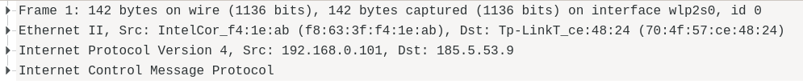

#### Frame

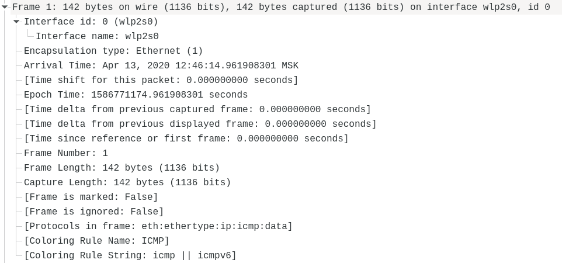

В контексте Wireshark термин *Frame* применяется к метаданным, собранным при наблюдении пакета.

### Ethernet II

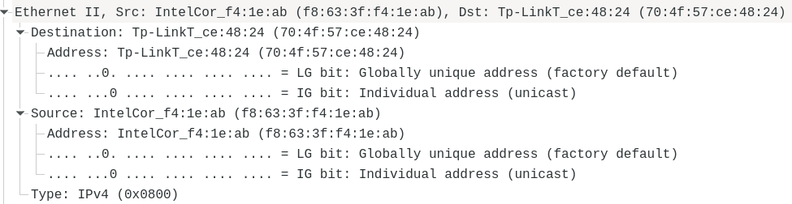

Заголовок Ethernet II содержит в себе управляющие данные канального уровня:
* тип протокола (`EtherType`), в данном случае `IPv4`
* MAC-адреса отправителя и получателя

#### IPv4

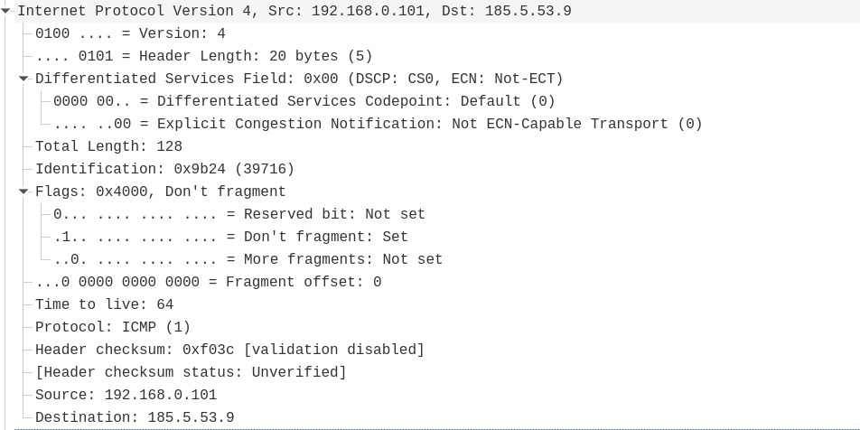

Заголовок IPv4 содержит в себе управляющие данные сетевого уровня:
* версию протокола (`4`)
* длину заголовка в 32-битных словах (`5`), изменяющуюся в случае указания опций пакета
* класс обслуживания, который *может* использоваться маршрутизаторами
для определения порядка отбрасывания пакетов в случае сетевых проблем
* идентификационный номер, используемый при фрагментации пакета
* флаги
* время жизни — число маршрутизаторов, через которые пакет может пройти до того, как будет отброшен; предотвращает бесконечное циркулирование пакетов в сети в случае ошибок
* используемый протокол
* контрольную сумму заголовка
* IP-адреса отправителя и получателя

Отдельно рассмотрим флаги:
* первый бит зарезервирован, всегда установлен в ноль
* второй бит, `don't fragment` (`DF`), указывает на то, что пакет должен быть отброшен,
если для его передачи требуется фрагментация, и используется для определения максимального
размера пакета, который не будет фрагментирован (MTU)
* третий бит, `more fragments` (`MF`), устанавливается всеми фрагментированными пакетами
кроме последнего

#### ICMP

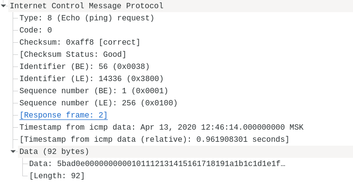

ICMP — протокол сетевого уровня, который используется для передачи диагностической информации
и сообщениях об ошибках, возникших при передаче данных.

Заголовок IPv4 содержит в себе следующие управляющие данные:
* тип сообщения, в данном случае ping-запрос
* подтип сообщения, в случае ping-запроса всегда `0`
* контрольная сумма заголовка и данных

#### Вопросы к заданию

1. Имеет ли место фрагментация исходного пакета, какое поле на это указывает?

Фрагментация имеет мест при превышении максимального размера пакета (MTU — Maximum Transmission Unit), на что указывает один из управляющих флагов протокола IPv4.
MTU для Ethernet составляет 1500 байт.

2. Какая информация указывает, является ли фрагмент пакета последним или промежуточным?

Флаг `MF` устанавливается в 1, если пакет является промежуточным, и в 0, если он последний
или единственный.

3. Чему равно количество фрагментов при передаче ping-пакетов?

Определим максимальный размер данных, передаваемых в одном пакете: из MTU вычтем размер
IPv4 заголовка (20 байт) и ICMP заголовка (8 байт), получим 1472 байта.

Количество пакетов можно аппроксимировать, как $S / 1472$,
где $S$ — размер данных в ICMP пакете.

Количество фрагментов $F$ в зависимости от размера отправленных пакетов $S$:

Таблица ?

| S   | 100 | 500 | 1000 | 1500 | 2000 | 3000 | 5000 | 7000 | 10000 |
| --- | --- | --- | ---- | ---- | ---- | ---- | ---- | ---- | ----- |
| F   | 1   | 1   | 1    | 2    | 2    | 3    | 4    | 5    | 7     |

4. Построить график, в котором на оси абсцисс находится размер пакета $S$,
а по оси ординат – количество фрагментов, на которое был разделён каждый ping-пакет:

```{r, echo=F}
s <- c(100, 500, 1000, 1500, 2000, 3000, 4500, 6000, 7500, 9000, 10000)
f <- c(1, 1, 1, 2, 2, 3, 4, 5, 6, 7, 7)
plot(s, f, type="s", xlab="размер пакета", ylab="кол-во фрагментов")
```

5. Как изменить поле TTL с помощью утилиты ping?

Передать необходимое значение с ключом `-t`.

6. Что содержится в поле данных ping-пакета?

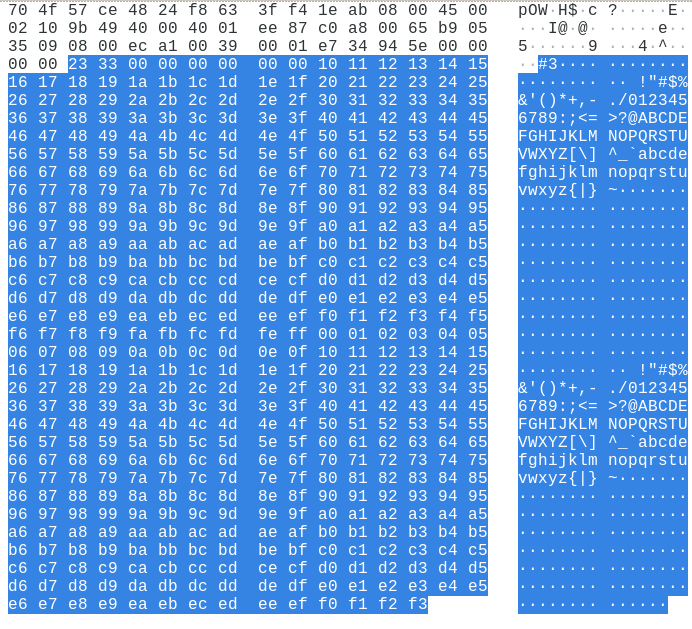

Время отправки пакета, затем повторяющаяся последовательность байт `00`...`ff`.

### Анализ трафика утилиты traceroute

Трафик, создаваемый утилитой `traceroute`, состоит из UDP пакетов с увеличивающимся значением
TTL (начиная с 1), причем на каждое значение отправляется три пакета.

Рассмотрим один из запросов утилиты:

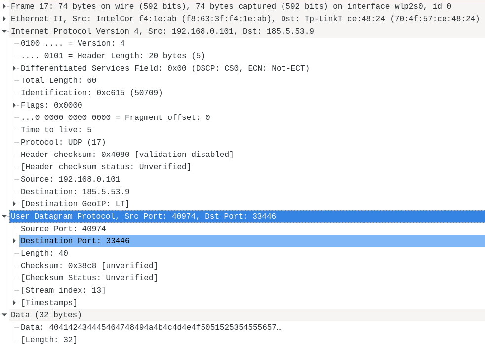

Используемые протоколы были рассмотрены ранее, за исключением UDP.

#### UDP

Заголовок UDP содержит в себе следующие управляющие данные:
* номера портов отправителя и получателя
* размер пакета (8 байт заголовка + размер передаваемых данных)
* контрольная сумма

#### ICMP ответ

Если TTL пакета недостаточен, чтобы достигнуть получателя, пакет отбрасывается,
а промежуточный маршрутизатор отправляет ICMP сообщение с ошибкой:

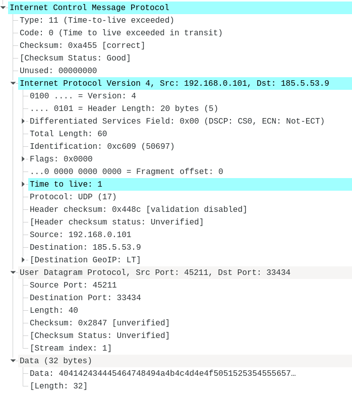

Если пакет доходит до получателя, то отправляется иное сообщениее — в данном случае,
сообщение ICMP о том, что порт, к которому обращается `traceroute`, не найден:

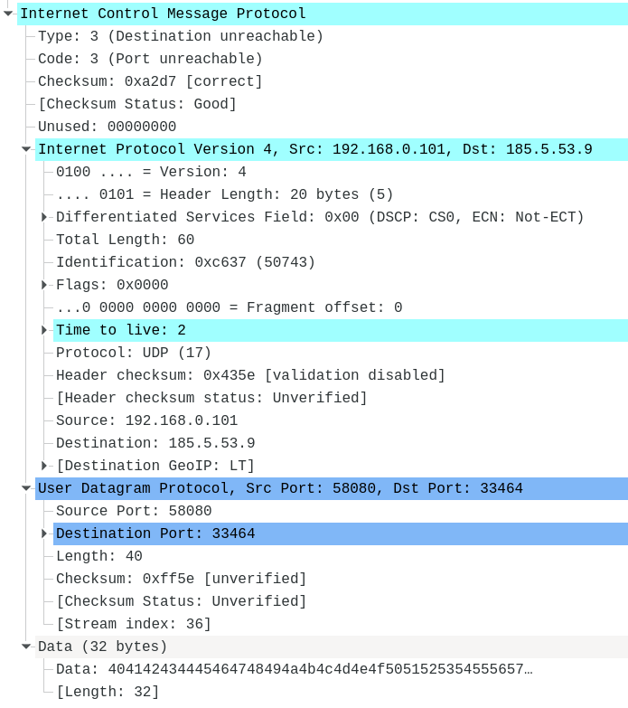

#### Вопросы к заданию

1. Сколько байт содержится в заголовке IP? Сколько байт содержится в поле данных?

Заголовок IPv4 содержит 20 байт (см. разбор трафика утилиты `ping`).
Поле данных содержит 40 байт и состоит из заголовка UDP (8 байт) и данных (32 байта).

2. Как и почему именно так изменяется поле TTL в следующих друг за другом ICMP-пакетах  
(проследить изменение TTL в как минимум пяти подряд идущих пакетах)?

Каждые три пакета значение TTL увеличивается на 1. Каждый промежуточный маршрутизатор
декрементирует значение TTL и отправляет ошибку при достижении нуля. Сообщения об ошибке
позволяют утилите отследить промежуточные маршрутизаторы, через которые пакет проходит до
получателя.

3. Чем отличаются ICMP-пакеты, генерируемые утилитой, от ICMP-пакетов,
генерируемых утилитой ping

При использовании ключа `-I` для отправки ICMP запросов вместо UDP, пакеты отличаются
только значением TTL.

4. Чем отличаются полученные пакеты "ICMP reply" от "ICMP error" и зачем нужны оба
этих типа ответов?

ICMP error пакеты приходят как при отбрасывании пакета промежуточным узлом, так и
по достижении получателя. Они отличаются типом ошибки (TTL exceeded, port unreachable).

ICMP reply пакеты отправляются получателем в случае использования ICMP вместо UDP.

5. Что изменится в работе traceroute, если убрать ключ `-d`? Какой
дополнительный трафик при этом будет генерироваться?

IP-адреса промежуточных адресов будут преобразованы в доменные имена, в связи с чем
будут сгенерированы дополнительные DNS запросы.

### Анализ HTTP-трафика

Трафик, создаваемый браузером при посещении сайта, отслеживается с помощью Wireshark.
Необходимо сравнить GET-запрос браузера и ответ сервера при первичном посещении страницы
и при вторичном запросе (условный GET).

При первичном посещении страницы запрос выглядит следующим образом:

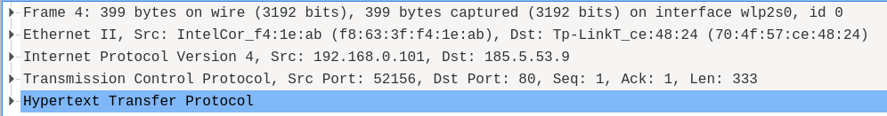

#### TCP

Рассмотрим содержимое пакета на уровне TCP, транспортного протокола, который отвечает за
установление соединения и обмен байтами между двумя узлами в заданном порядке, с обработкой
ошибок.

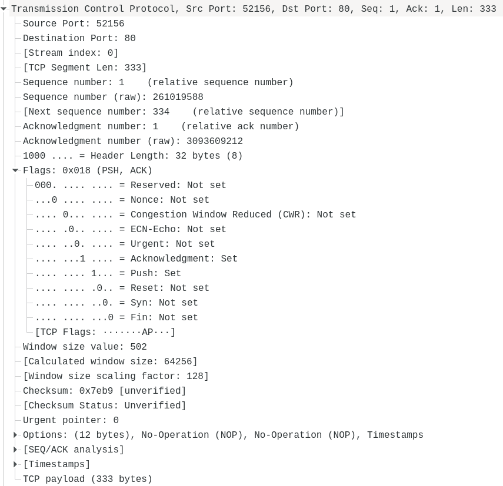

Передаваемые метаданные включают в себя порт отправителя и получателя, контрольную сумму, а также
следующие управляющие флаги:
* `Urgent` (`URG`): указывает, что в заголовке установлен `Urgent Pointer` (не используется в
современных протоколах)
* `Acknowledgment` (`ACK`): указывает, что в заголовке установлено поле `Acknowledgment`, 
подтверждающее принятие данных
* `Push` (`PSH`): указывает получателю, что принятые данные должны быть сразу переданы в
приложение, не дожидаясь заполнения буфера
* `Reset` (`RST`): обрыв соединения
* `Syn`: синхронизация номера последовательности, устанавливается в первом пакете, отправленном
с каждой стороны
* `Fin`: помечает отправленный пакет как последний

#### HTTP

Рассмотрим содержимое пакета на уровне прикладного протокола HTTP:

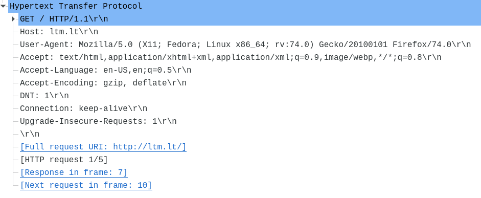

Передаваемые данные разделены на следующие секции, разделенные переносом строки (`\r\n`):
* стартовую строку, определяющую метод запроса, запрашиваемый путь и версию протокола
* заголовки, содержащие информацию о клиенте, сервере, соединении и самих данных в виде
пар `key: value`
* тело сообщения

Ответ сервера:


Можно увидеть, что в ответе заголовок `Cache-Control`, отвечающий за кэширование, устанавливается
в `no-store`. Это инструктирует браузер не сохранять данные и при повторном обращении выполнить
такой же запрос, как и при первом.

Сравним с ответом сервера на запрос статического ресурса, который может быть сохранен
в браузерном кэше:

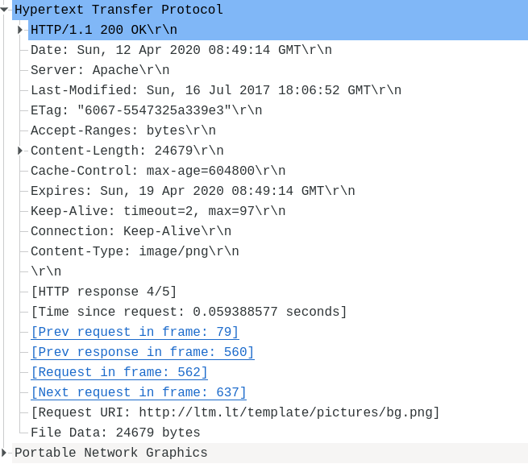

При повторной загрузке сайта браузер установит заголовки `If-Modified-Since` и `If-None-Match`.

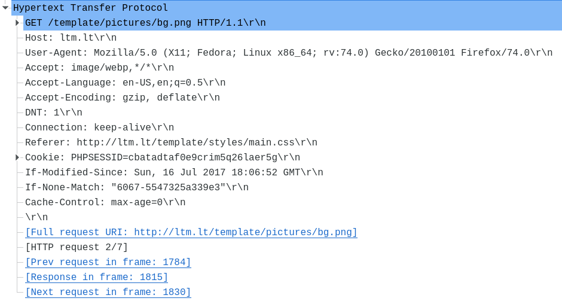

Поскольку статический ресурс не был изменен после указанной в заголовке даты, сервер отправит
ответ со статусом `304 (Not Modified)`, без данных.

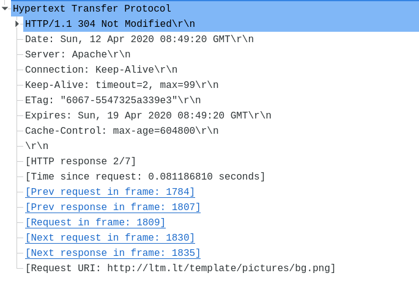

### Анализ DNS-трафика

DNS — система трансляции между доменными именами и IP-адресами.

#### DNS-запрос

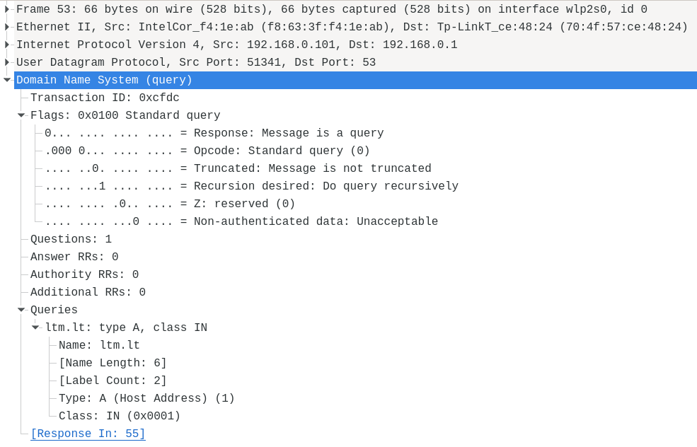

Сообщение DNS включает в себя следующие управляющие данные:
* однобитовый флаг `Response` (`QR`): является ли сообщение запросом (query = 0) или ответом
(response = 1)
* четырехбитовое поле `Opcode` (`OPCODE`): тип запроса (стандартный = 0, обратный = 1,
статус сервера = 2)
* однобитовый флаг `Truncated` (`TC`): было ли сообщение обрезано из-за превышения
ограничения на размер
* однобитовый флаг `Recursion desired` (`RD`): является ли запрос рекурсивным
* трехбитовое зарезервированное поле
* однобитовый флаг `Non-authenticated data`: устанавливается в 1, если ответ содержит
данные из достоверного источника

В секции `Queries` содержится информация о запросах:
* имя домена
* тип запроса (`A` — IPv4 адрес, `AAAA` — IPv6 адрес)
* класс запроса, устанавливается в `IN` для хостов в сети Интернет

#### DNS-ответ

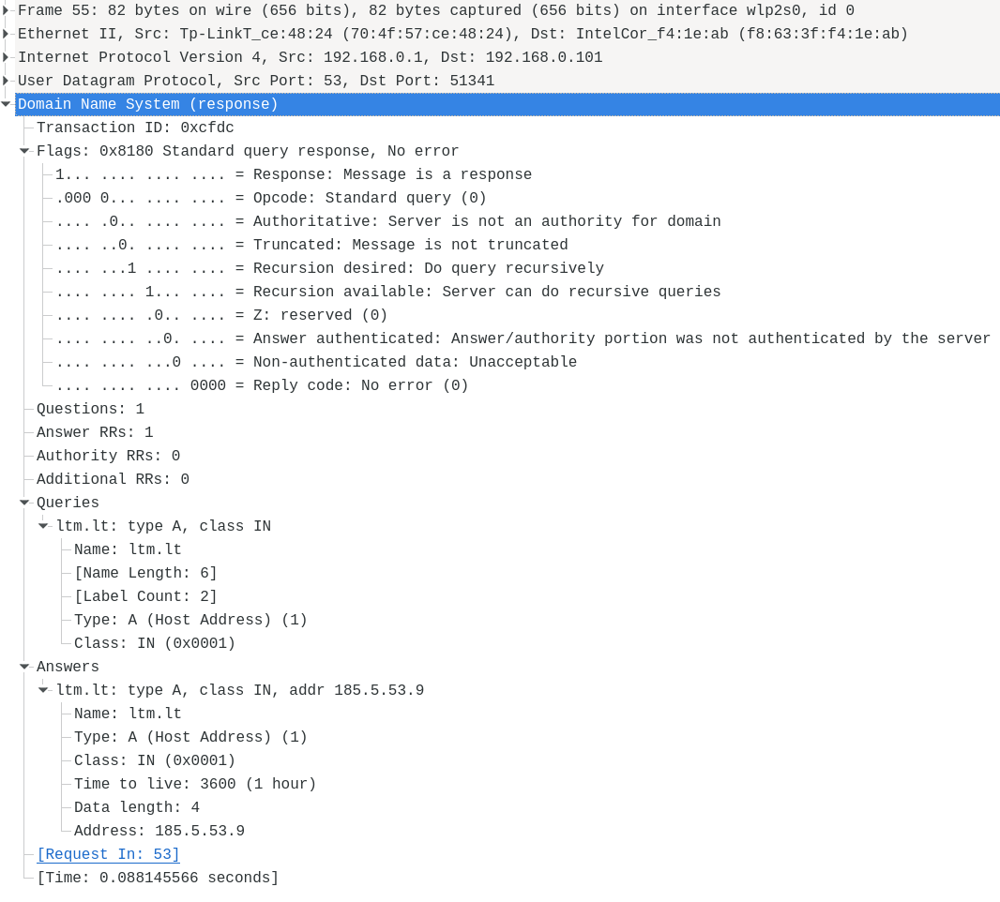

В добавление к данным, передаваемым в запросе, добавляются:
* однобитовый флаг `Authoritative` (`AA`): является ли сервер авторитарным для данного домена
* однобитовый флаг `Recursion available` (`RA`): предоставляет ли сервер возможность выполнения
рекурсивных запросов
* поле `Answer authenticated`: является ли ответ удостоверенным
* четырехбитовое поле `Reply code` (`RCODE`): 0 = успешный ответ, 1 = `FORMERR` (неверный запрос),
2 = `SERVFAIL` (ошибка сервера), 3 = `NXDOMAIN` (несуществующий домен) и др.

В секции `Answers` содержится информация об ответах сервера:
* имя домена
* тип запроса
* класс запроса
* время, в течение которого информация остается валидной, в секундах
* запрошенная информация (в данном случае, IP-адрес)

#### Вопросы к заданию

1. Почему адрес, на который отправлен DNS-запрос, не совпадает с адресом посещаемого сайта?

DNS-запрос отправляется на адрес DNS-сервера, чтобы узнать IP-адрес посещаемого сайта.

2. Какие бывают типы DNS-запросов?

* итеративный: DNS-сервер не опрашивает другие серверы
* рекурсивный: DNS-сервер может обращаться к другим серверам
* обратный: запрос доменного имени по IP-адресу

3. В какой ситуации нужно выполнять независимые DNS-запросы для получения содержащихся на сайте 
изображений?

В случае, если изображения размещены на другом доменном имени (в том числе поддомене).
