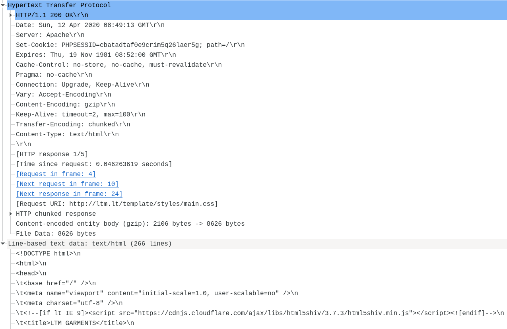

## Цель

Изучить структуру протокольных блоков данных, анализируя реальный трафик на компьютере студента
с помощью бесплатно распространяемой утилиты Wireshark.

## Задание

В процессе выполнения домашнего задания выполняются наблюдения за передаваемым трафиком
с компьютера пользователя в Интернет и в обратном направлении. Применение специализированной
утилиты Wireshark позволяет наблюдать структуру передаваемых кадров, пакетов и сегментов данных
различных сетевых протоколов. При выполнении УИР требуется анализировать последовательности
команд и назначение служебных данных, используемых для организации обмена данными в следующих 
протоколах: ARP, DNS, FTP, HTTP, DHCP.

## Исходные данные

В качестве адреса сайта в заданиях используются следующие URL:
* HTTP: http://ltm.lt/
* FTP: ?

## Ход работы

### Анализ трафика утилиты ping

Трафик, создаваемый утилитой `ping`, отслеживается с помощью Wireshark со следующими настройками:
* Захватывается интерфейс `wlp2s0` (Wi-Fi)
* Фильтр `host 185.5.53.9` (IP адрес выбранного HTTP сайта)

Для варьирования размера пакетов утилита `ping` запускалась следующим образом:

`for s in 100 500 1000 1500 2000 3000 4000 5000 7000 10000; do ping -c 1 -s $s ltm.lt; done`

Для установки размера передаваемых данных используется ключ `-s`.

???

### Анализ трафика утилиты traceroute

???

### Анализ HTTP-трафика

Трафик, создаваемый браузером при посещении сайта, отслеживается с помощью Wireshark.
Необходимо сравнить GET-запрос браузера и ответ сервера при первичном посещении страницы
и при вторичном запросе (условный GET).

При первичном посещении страницы запрос выглядит следующим образом:

#### TCP

Рассмотрим содержимое пакета на уровне TCP, транспортного протокола, который отвечает за
установление соединения и обмен байтами между двумя узлами в заданном порядке, с обработкой
ошибок.

Передаваемые метаданные включают в себя порт отправителя и получателя, контрольную сумму, а также
следующие управляющие флаги:
* `Urgent` (`URG`): указывает, что в заголовке установлен `Urgent Pointer` (не используется в
современных протоколах)
* `Acknowledgment` (`ACK`): указывает, что в заголовке установлено поле `Acknowledgment`, 
подтверждающее принятие данных
* `Push` (`PSH`): указывает получателю, что принятые данные должны быть сразу переданы в
приложение, не дожидаясь заполнения буфера
* `Reset` (`RST`): обрыв соединения
* `Syn`: синхронизация номера последовательности, устанавливается в первом пакете, отправленном
с каждой стороны
* `Fin`: помечает отправленный пакет как последний

#### HTTP

Рассмотрим содержимое пакета на уровне прикладного протокола HTTP:

Передаваемые данные разделены на следующие секции, разделенные переносом строки (`\r\n`):
* стартовую строку, определяющую метод запроса, запрашиваемый путь и версию протокола
* заголовки, содержащие информацию о клиенте, сервере, соединении и самих данных в виде
пар `key: value`
* тело сообщения

Ответ сервера:

Можно увидеть, что в ответе заголовок `Cache-Control`, отвечающий за кэширование, устанавливается
в `no-store`. Это инструктирует браузер не сохранять данные и при повторном обращении выполнить
такой же запрос, как и при первом.

Сравним с ответом сервера на запрос статического ресурса, который может быть сохранен
в браузерном кэше:

При повторной загрузке сайта браузер установит заголовки `If-Modified-Since` и `If-None-Match`.

Поскольку статический ресурс не был изменен после указанной в заголовке даты, сервер отправит
ответ со статусом `304 (Not Modified)`, без данных.

