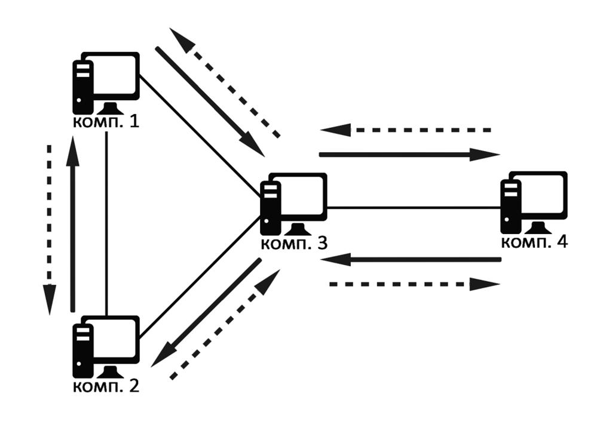
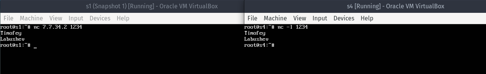
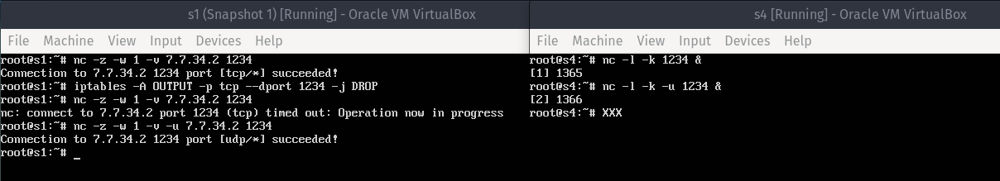
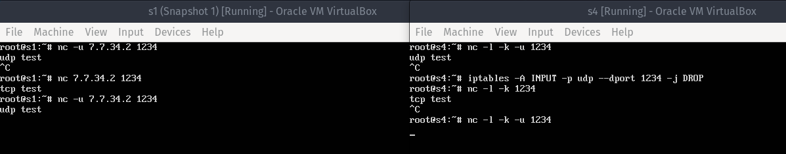
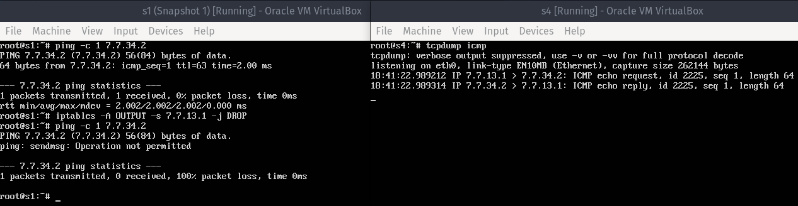
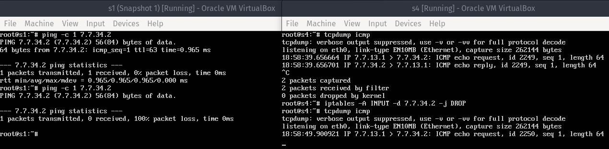
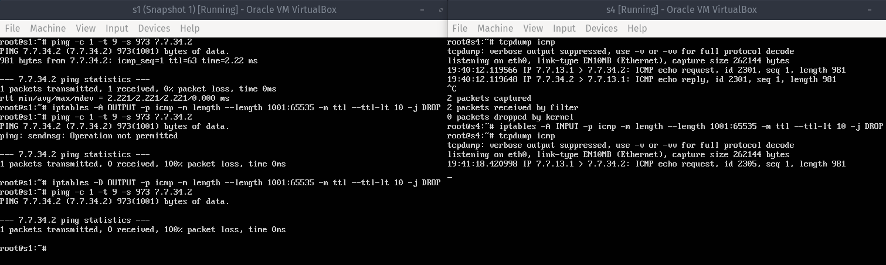
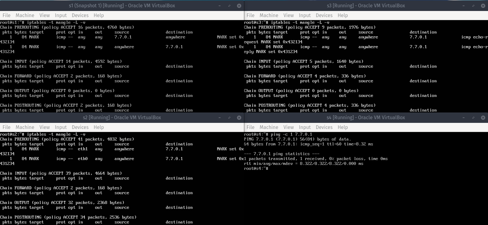
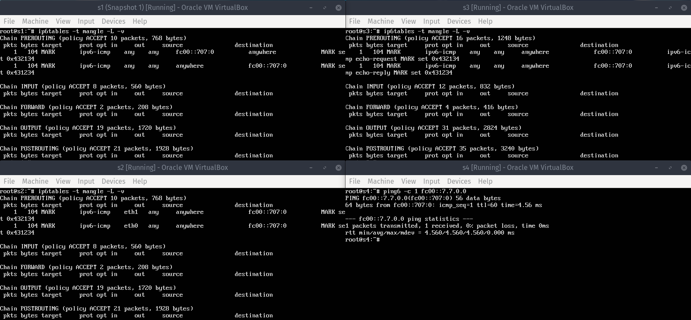

## Цель

Изучение основных методов настройки маршрутизируемых компьютерных сетей на примере сети,
состоящей из компьютеров под управлением ОС Linux.

## Задание

В процессе выполнения работы изучается сетевой уровень модели OSI.
Производится базовая настройка связности в сети, управление таблицами маршрутизации и
правилами трансляции сетевых адресов. При помощи утилиты tcpdump выполняются наблюдения
за передачей трафика по каналам связи в маршрутизируемой компьютерной сети.
Применение утилиты tcpdump позволяет непосредственно в терминале (это основной метод
управления сетевым оборудованием) наблюдать проходящие через интерфейсы компьютера
пакеты и изучить их внутреннюю структуру.

## Исходные данные

Вариант выполнения работы V1 = 1 + (14 mod 5) = 5.



На рисунке 1 изображена топология сети и требуемый путь прохождения сетевых пакетов.

С компьютера 4 посылается `ICMP Echo Request` на адрес, который не существует в данной сети.
На компьютерах 1, 2 и 3 должны быть настроены таблицы маршрутизации и правила NAT
таким образом, чтобы пакет поочередно прошел через компьютеры 3, 2, 1
и, снова пройдя через компьютер 3, пришел на компьютер 4 (сплошные линии
на рисунке 1) с IP заголовком, в котором IP адрес источника и IP адрес
назначения будут поменяны местами.

Таким образом, компьютер 4 получит `ICMP Echo Request` на свой локальный адрес
и ответит на него. `ICMP Echo Reply` должен пройти обратный путь (4->3->1->2->3->4)
и прийти на компьютер 4 (штриховые линии на рисунке 1) с поменяными местами
адресами источника и назначения.

В результате выполнения команды `ping` должна быть выведена информация об
успешном выполнении. То есть компьютер 4 сам отвечает на собственные ICMP запросы,
однако пакет проходит через внешнюю сеть маршрутизаторов.

## Ход работы

### Настройка сети

Настроим IPv4 адреса компьютеров `A.B.X.Y/M` в топологии следующим образом:
* `A` равно количеству букв в имени студента (7)
* `B` равно количеству букв в фамилии студента (7)
* `X` и `Y` выбирается случайно
* `M` принимается равной 30, максимальному значению для обеспечения связи двух компьютеров
(два адреса из четырех возможных — минимальный и максимальный — зарезервированы)

Назначим следующие адреса подсетей:
* `7.7.12.0/30` для связи компьютеров 1 и 3 (сетевой адаптер `s1_s2` в VirtualBox)
* `7.7.13.0/30` для связи компьютеров 1 и 3 (сетевой адаптер `s1_s3` в VirtualBox)
* `7.7.23.0/30` для связи компьютеров 2 и 3 (сетевой адаптер `s2_s3` в VirtualBox)
* `7.7.34.0/30` для связи компьютеров 3 и 4 (сетевой адаптер `s3_s4` в VirtualBox)

Для IPv6 адресов назначим маску `/127` (2 адреса) и следующие адреса подсетей:
* `fc00::7.7.12.0/127` (`fc00:0:0:0:0:0:707:c00/127`) для `s1_s2`
* `fc00::7.7.13.0/127` для `s1_s3`
* `fc00::7.7.23.0/127` для `s2_s3`
* `fc00::7.7.34.0/127` для `s3_s4`

Настройка компьютера `s1`:
```
ip link set eth0 up
ip link set eth1 up

ip a add 7.7.12.1/30 dev eth0
ip a add 7.7.13.1/30 dev eth1
ip -6 a add fc00::7.7.12.0/127 dev eth0
ip -6 a add fc00::7.7.13.0/127 dev eth1

ip ro add 7.7.34.2 via 7.7.13.2
ip -6 ro add fc00::7.7.34.1 via fc00::7.7.13.1
```

Настройка компьютера `s2`:
```
ip link set eth0 up
ip link set eth1 up

ip a add 7.7.12.2/30 dev eth0
ip a add 7.7.23.1/30 dev eth1
ip -6 a add fc00::7.7.12.1/127 dev eth0
ip -6 a add fc00::7.7.23.0/127 dev eth1

ip ro add 7.7.34.2 via 7.7.23.2
```

Настройка компьютера `s3`:
```
ip link set eth0 up
ip link set eth1 up
ip link set eth2 up

ip a add 7.7.13.2/30 dev eth0
ip a add 7.7.23.2/30 dev eth1
ip a add 7.7.34.1/30 dev eth2
ip -6 a add fc00::7.7.13.1/127 dev eth0
ip -6 a add fc00::7.7.23.1/127 dev eth1
ip -6 a add fc00::7.7.34.0/127 dev eth2

sysctl -w net.ipv4.ip_forward=1
sysctl -w net.ipv4.conf.all.rp_filter=0
```

Настройка компьютера `s4`:
```
ip link set eth0 up

ip a add 7.7.34.2/30 dev eth0
ip -6 a add fc00::7.7.34.1/127 dev eth0

ip ro add 7.7.13.1 via 7.7.34.1
ip ro add 7.7.23.1 via 7.7.34.1
```

### Проверка работоспособности

Для проверки сети возьмем компьютеры #1 и #4, трафик между которыми проходит
через шлюз, которым выступает компьютер #3.



### Настройка межсетевого экрана

1. Запретить передачу только тех пакетов, которые отправлены на TCP-порт, заданный в настройках утилиты nc.

Для порта 1234 на компьютере, который отправляет пакеты, создадим следующее правило:
```
iptables -A OUTPUT -p tcp --dport 1234 -j DROP
```
По умолчанию правило помещается в таблицу `filter`.

Для проверки запустим `nc` с ключами `-z` (проверка соединения без отправки данных) и
`-w 1` (ограничение времени на установку соединения):



2. Запретить приём только тех пакетов, которые отправлены с UDP-порта утилиты nc.

Для порта 1234 на компьютере, который принимает пакеты, создадим следующее правило:
```
iptables -A INPUT -p udp --sport 1234 -j DROP
```



3. Запретить передачу только тех пакетов, которые отправлены с IP-адреса компьютера А.

На передающей стороне создадим следующее правило:
```
iptables -A OUTPUT -s 7.7.13.1 -j DROP
```



4. Запретить приём только тех пакетов, которые отправлены на IP-адрес компьютера Б.

На принимающей стороне создадим следующее правило:
```
iptables -A INPUT -d 7.7.34.2 -j DROP
```

`ICMP Echo Request` отображается на принимающей стороне, поскольку `tcpdump`
получает трафик до его фильтрации. `ICMP Echo Reply` при этом уже не отправляется:



5. Запретить приём и передачу ICMP-пакетов, размер которых превышает 1000 байт, а поле TTL при этом меньше 10.

На передающей стороне создадим следующее правило:
```
iptables -A OUTPUT -p icmp -m length --length 1001:65535 -m ttl --ttl-lt 10 -j DROP
```
На принимающей стороне создадим такое же правило, заменив цепочку `OUTPUT` на `INPUT`.



### Выполнение вариативной части

В качестве несуществующего адреса в сети возьмем `7.7.0.1`.

На компьютере #4 настроим отправку всех пакетов на выбранный адрес через компьютер #3:
```
ip link set eth0 up

ip a add 7.7.34.2/30 dev eth0

ip ro add 7.7.0.1 via 7.7.34.1

sysctl -w net.ipv4.ip_forward=1
sysctl -w net.ipv4.conf.all.rp_filter=0
sysctl -w net.ipv4.conf.eth0.rp_filter=0
```

На компьютере #3 настроим перенаправление трафика в зависимости от типа ICMP-пакета:
если это `echo request` (`ping`), то перенаправляем на компьютер #2, если же это
`echo reply` (`pong`), то перенаправляем на компьютер #1:
```
ip link set eth0 up
ip link set eth1 up
ip link set eth2 up

ip a add 7.7.13.2/30 dev eth0
ip a add 7.7.23.2/30 dev eth1
ip a add 7.7.34.1/30 dev eth2

# 4->3->2->1->3->4
iptables -t mangle -A PREROUTING -p icmp --icmp-type ping -d 7.7.0.1 -j MARK --set-mark 0x432134
# 4->3->1->2->3->4
iptables -t mangle -A PREROUTING -p icmp --icmp-type pong -d 7.7.0.1 -j MARK --set-mark 0x431234

ip ro add table 432134 default via 7.7.23.1 dev eth1
ip rule add fwmark 0x432134 table 432134

ip ro add table 431234 default via 7.7.13.1 dev eth0
ip rule add fwmark 0x431234 table 431234

sysctl -w net.ipv4.ip_forward=1
sysctl -w net.ipv4.conf.all.rp_filter=0
sysctl -w net.ipv4.conf.eth0.rp_filter=0
sysctl -w net.ipv4.conf.eth1.rp_filter=0
sysctl -w net.ipv4.conf.eth2.rp_filter=0
```

На компьютере #2 настроим перенаправление трафика и замену IP-адресов
получателя и отправителя с помощью правил `DNAT` и `SNAT` соответственно:
```
ip link set eth0 up
ip link set eth1 up

ip a add 7.7.12.2/30 dev eth0
ip a add 7.7.23.1/30 dev eth1

iptables -t nat -A PREROUTING -p icmp -s 7.7.34.2 -d 7.7.0.1 -j DNAT --to 7.7.34.2
iptables -t nat -A POSTROUTING -p icmp -s 7.7.34.2 -d 7.7.34.2 -j SNAT --to 7.7.0.1

# 4->3->2->1->3->4
iptables -t mangle -A PREROUTING -p icmp -i eth1 -d 7.7.0.1 -j MARK --set-mark 0x432134
# 4->3->1->2->3->4
iptables -t mangle -A PREROUTING -p icmp -i eth0 -d 7.7.0.1 -j MARK --set-mark 0x431234

ip ro add table 432134 default via 7.7.12.1 dev eth0
ip rule add fwmark 0x432134 table 432134

ip ro add table 431234 default via 7.7.23.2 dev eth1
ip rule add fwmark 0x431234 table 431234

sysctl -w net.ipv4.ip_forward=1
sysctl -w net.ipv4.conf.all.rp_filter=0
sysctl -w net.ipv4.conf.eth0.rp_filter=0
sysctl -w net.ipv4.conf.eth1.rp_filter=0
```

На компьютере #1 настроим перенаправление трафика:
```
ip link set eth0 up
ip link set eth1 up

ip a add 7.7.12.1/30 dev eth0
ip a add 7.7.13.1/30 dev eth1

# 4->3->2->1->3->4
iptables -t mangle -A PREROUTING -p icmp -s 7.7.0.1 -j MARK --set-mark 0x432134
# 4->3->1->2->3->4
iptables -t mangle -A PREROUTING -p icmp -d 7.7.0.1 -j MARK --set-mark 0x431234

ip ro add table 432134 default via 7.7.13.2 dev eth1
ip rule add fwmark 0x432134 table 432134

ip ro add table 431234 default via 7.7.12.2 dev eth0
ip rule add fwmark 0x431234 table 431234

sysctl -w net.ipv4.ip_forward=1
sysctl -w net.ipv4.conf.all.rp_filter=0
sysctl -w net.ipv4.conf.eth0.rp_filter=0
sysctl -w net.ipv4.conf.eth1.rp_filter=0
```

Убедимся в правильном прохождении пакетов, отправив один запрос с помощью `ping -c 1 7.7.0.1`
и проверив число пакетов, соответствующих всем `mangle` правилам, отвечающим за маркировку пакета:



### Выполнение вариативной части (IPv6)

В качестве несуществующего адреса в сети возьмем `fc00::7.7.0.0`.

На компьютере #4 настроим отправку всех пакетов на выбранный адрес через компьютер #3:
```
ip link set eth0 up

ip -6 a add fc00::7.7.34.1/127 dev eth0

ip -6 ro add fc00::7.7.0.0 via fc00::7.7.34.0

sysctl -w net.ipv6.conf.all.forwarding=1
```

На компьютере #3 настроим перенаправление трафика в зависимости от типа ICMP-пакета:
если это `echo request` (`ping`), то перенаправляем на компьютер #2, если же это
`echo reply` (`pong`), то перенаправляем на компьютер #1:
```
ip link set eth0 up
ip link set eth1 up
ip link set eth2 up

ip -6 a add fc00::7.7.13.1/127 dev eth0
ip -6 a add fc00::7.7.23.1/127 dev eth1
ip -6 a add fc00::7.7.34.0/127 dev eth2

# 4->3->2->1->3->4
ip6tables -t mangle -A PREROUTING -p icmpv6 --icmpv6-type ping -d fc00::7.7.0.0 -j MARK --set-mark 0x432134
# 4->3->1->2->3->4
ip6tables -t mangle -A PREROUTING -p icmpv6 --icmpv6-type pong -d fc00::7.7.0.0 -j MARK --set-mark 0x431234

ip -6 ro add table 432134 default via fc00::7.7.23.0 dev eth1
ip -6 rule add fwmark 0x432134 table 432134

ip -6 ro add table 431234 default via fc00::7.7.13.0 dev eth0
ip -6 rule add fwmark 0x431234 table 431234

sysctl -w net.ipv6.conf.all.forwarding=1
```

На компьютере #2 настроим перенаправление трафика и замену IP-адресов
получателя и отправителя с помощью правил `DNAT` и `SNAT` соответственно:
```
ip link set eth0 up
ip link set eth1 up

ip -6 a add fc00::7.7.12.1/127 dev eth0
ip -6 a add fc00::7.7.23.0/127 dev eth1

ip6tables -t nat -A PREROUTING -p icmpv6 -s fc00::7.7.34.1 -d fc00::7.7.0.0 -j DNAT --to fc00::7.7.34.1
ip6tables -t nat -A POSTROUTING -p icmpv6 -s fc00::7.7.34.1 -d fc00::7.7.34.1 -j SNAT --to fc00::7.7.0.0

# 4->3->2->1->3->4
ip6tables -t mangle -A PREROUTING -p icmpv6 -i eth1 -d fc00::7.7.0.0 -j MARK --set-mark 0x432134
# 4->3->1->2->3->4
ip6tables -t mangle -A PREROUTING -p icmpv6 -i eth0 -d fc00::7.7.0.0 -j MARK --set-mark 0x431234

ip -6 ro add table 432134 default via fc00::7.7.12.0 dev eth0
ip -6 rule add fwmark 0x432134 table 432134

ip -6 ro add table 431234 default via fc00::7.7.23.1 dev eth1
ip -6 rule add fwmark 0x431234 table 431234

sysctl -w net.ipv6.conf.all.forwarding=1
```

На компьютере #1 настроим перенаправление трафика:
```
ip link set eth0 up
ip link set eth1 up

ip -6 a add fc00::7.7.12.0/127 dev eth0
ip -6 a add fc00::7.7.13.0/127 dev eth1

# 4->3->2->1->3->4
ip6tables -t mangle -A PREROUTING -p icmpv6 -s fc00::7.7.0.0 -j MARK --set-mark 0x432134
# 4->3->1->2->3->4
ip6tables -t mangle -A PREROUTING -p icmpv6 -d fc00::7.7.0.0 -j MARK --set-mark 0x431234

ip -6 ro add table 432134 default via fc00::7.7.13.1 dev eth1
ip -6 rule add fwmark 0x432134 table 432134

ip -6 ro add table 431234 default via fc00::7.7.12.1 dev eth0
ip -6 rule add fwmark 0x431234 table 431234

sysctl -w net.ipv6.conf.all.forwarding=1
```

